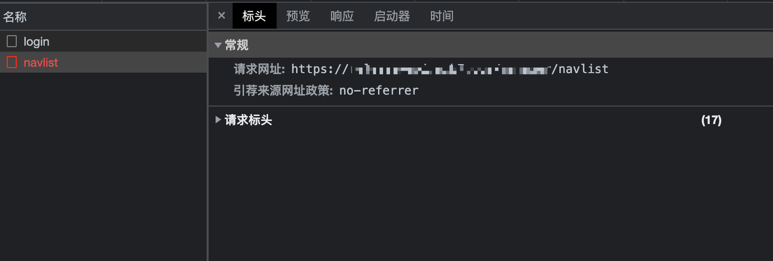
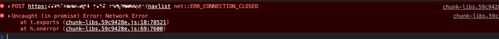
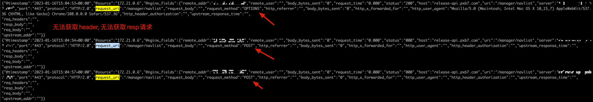
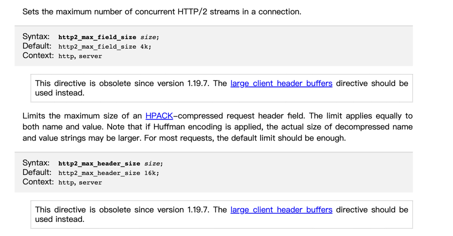
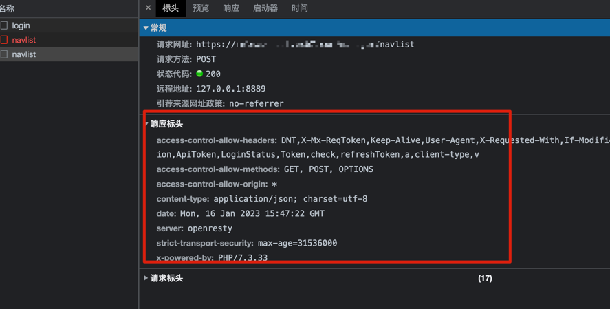

客户端使用VUE请求PHP登录接口成功, 在带着auth跳转到其他页面时, 出现了net::ERR_CONNECTION_CLOSED的报错, 接口通过postman请求正常, 能够获取数据, 以下是现场复原

<!--more-->
# 异常



> 只有请求头, 但是没有响应


> VUE控制台显示报错 **net::ERR_CONNECTION_CLOSED**


> Nginx日志记录了请求现场, 无法获取Header头, 无法获取resp请求体

# 思路

1. 检查PHP接口是否正常


2. 调整nginx config 将请求header及请求体记录到log

> 使用的是openresty, 如果你使用的是nginx, 请自行引入model
```nginx
## 首先定义请求头, 请求体
server
{
    ...

    set $resp_body "";
    set $req_body "";
    set $req_headers "";

    rewrite_by_lua_block {
    local req_headers = "Headers: ";
    ngx.var.req_body = ngx.req.get_body_data();
    local h, err = ngx.req.get_headers()
            for k, v in pairs(h) do
                req_headers = req_headers .. k .. ": " .. v .. "\n";
    end

            ngx.var.req_headers = req_headers;
}

    body_filter_by_lua '
        local resp_body = string.sub(ngx.arg[1], 1, 1000)
        ngx.ctx.buffered = (ngx.ctx.buffered or "") .. resp_body
        if ngx.arg[2] then
          ngx.var.resp_body = ngx.ctx.buffered
        end
        ';
    
    # 记录access
    access_log  /var/log/com.log json_combined;
}

## 再在server外定义nginx json
log_format json_combined escape=json '{"@timestamp":"$time_iso8601",'
'"@source":"$server_addr",'
'"@nginx_fields":{'
'"remote_addr":"$remote_addr",'
'"remote_user":"$remote_user",'
'"body_bytes_sent":"$body_bytes_sent",'
'"request_time":"$request_time",'
'"status":"$status",'
'"host":"$host",'
'"uri":"$uri",'
'"server":"$server_name",'
'"port":"$server_port",'
'"protocol":"$server_protocol",'
'"request_uri":"$request_uri",'
'"request_body":"$request_body",'
'"request_method":"$request_method",'
'"http_referrer":"$http_referer",'
'"body_bytes_sent":"$body_bytes_sent",'
'"http_x_forwarded_for":"$http_x_forwarded_for",'
'"http_user_agent":"$http_user_agent",'
'"http_header_authorization":"$http_authorization",'
'"upstream_response_time":"$upstream_response_time",'
\n
'"req_headers":"$req_headers",'
 \n
'"resp_body":"$resp_body",'
\n
'"req_body":"$req_body",'
\n
'"upstream_addr":"$upstream_addr"}}';
```

3. 分析nginx日志发现无法获取header头, 考虑有可能是header头过大导致无法获取, 那就继续调整nginx config, 将转发, 请求体等都放大

```nginx
# nginx.conf中增加
server_names_hash_bucket_size 512;
client_header_buffer_size 32k;
large_client_header_buffers 4 32k;
client_max_body_size 150m;

在 server中添加
location ~ \.php$ {
    client_body_buffer_size 512k;
    proxy_connect_timeout 60;
    proxy_read_timeout 60;
    proxy_send_timeout 60;
    proxy_buffer_size 32k;
    proxy_buffers 4 64k;
    proxy_busy_buffers_size 128k;
    proxy_temp_file_write_size 128k;
    proxy_max_temp_file_size 0;
    proxy_next_upstream error timeout invalid_header http_500 http_503 http_404;
    client_max_body_size 150m;
    fastcgi_connect_timeout 300;
    fastcgi_send_timeout 300;
    fastcgi_read_timeout 300;
    fastcgi_busy_buffers_size 512k;
    fastcgi_temp_file_write_size 256k;
    fastcgi_buffers 16 256k;
    fastcgi_buffer_size 256k;
    fastcgi_intercept_errors on;


    try_files $uri /index.php =404;
    fastcgi_pass php-upstream;
    fastcgi_index index.php;
    fastcgi_param SCRIPT_FILENAME $document_root$fastcgi_script_name;
    include fastcgi_params;
}

```
> 调整完后还是获取不到Header头等数据

4. 至此还没有解决问题, 就开始急病乱投医, 包括不限于重新处理VUE代码, PHP代码, Linux文件权限, 自己电脑的代理问题等
最后没有办法, 只能从[nginx官方文档]一点点找, 最后找出关键点!



> 如果nginx版本是version 1.19.7及以上, 那么就使用large_client_header_buffers

我的nginx版本是 _nginx version: openresty/1.19.3.2_
所以在nginx.conf增加
```nginx
http2_max_field_size 16k; # default 4k
```
> 这里我只修改了http2_max_field_size就解决了问题, http2_max_header_size使用了默认值, 因为上面说如果调整了, 或许会使解压后的数据过大, 如果你没有解决问题, 可以尝试下

# 结束
好了, 搞定


[nginx官方文档]: https://nginx.org/en/docs/http/ngx_http_v2_module.html


